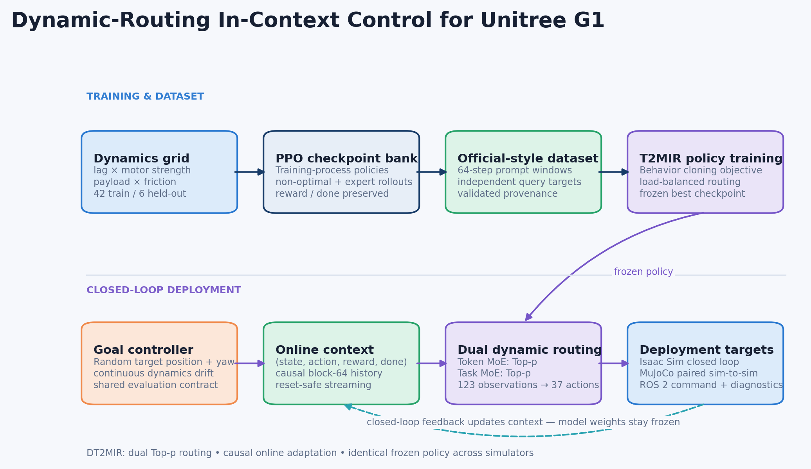
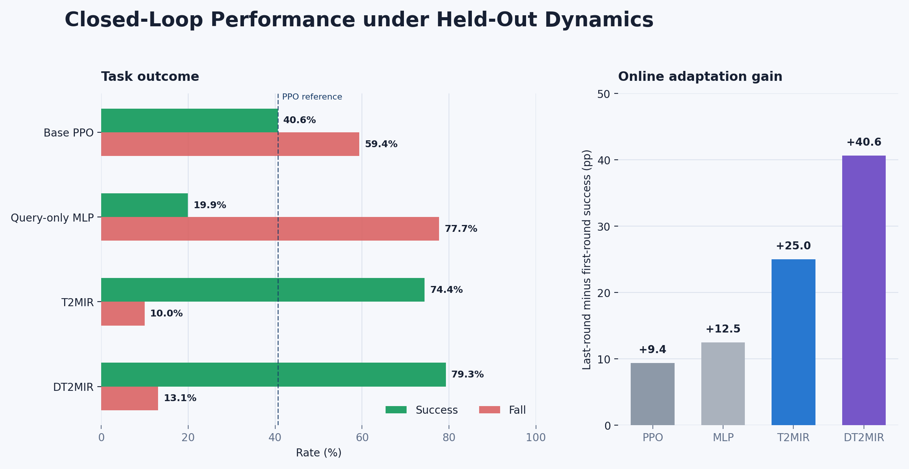
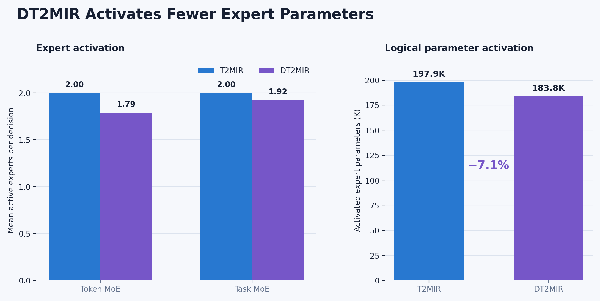
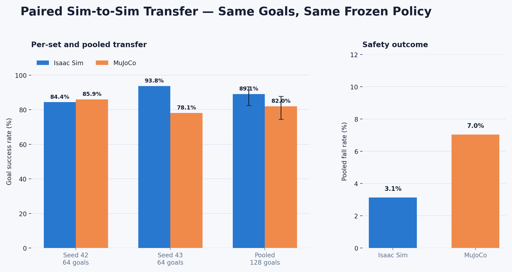

# Dynamic-Routing In-Context Control for Unitree G1

This repository is a RobotLab-based internship demo for adaptive humanoid
locomotion. It extends T2MIR with independently configurable Top-p routing in
the token and task MoE layers, builds a 42-profile multi-dynamics dataset, and
deploys the resulting policy through Isaac Sim, MuJoCo and ROS 2.

> Status: private research demo for internship evaluation. The code and frozen
> evaluation artifacts are organized for reviewer access. Public redistribution
> remains blocked until the T2MIR-derived source and robot-asset licenses are
> confirmed.

## What is demonstrated

- A reproducible 42-train / 6-held-out dynamics manifest spanning action lag,
  motor strength, payload and friction.
- An official-style T2MIR prompt/query dataset pipeline with checkpoint-bank
  collection, validation, actor-mean relabeling and immutable provenance.
- Four routing variants: fixed/fixed, dynamic/fixed, fixed/dynamic and
  dynamic/dynamic, with optional load-balancing losses. The formal comparison
  names the fixed-routing model T2MIR and the dual-dynamic model DT2MIR.
- Closed-loop goal reaching in Isaac Sim with causal block-64 online context.
- A 123-observation / 37-action MuJoCo deployment contract and ROS 2 command,
  diagnostics and feedback path.
- Strict paired sim-to-sim evaluation using identical goal files and frozen
  model/controller settings.



## Main results

### Isaac Sim held-out dynamics evaluation, task47, 512 episodes



| Policy | Success | Fall | Adaptation delta |
|---|---:|---:|---:|
| Base PPO | 40.63% | 59.38% | +9.38 pp |
| Matched query-only MLP | 19.92% | 77.73% | +12.50 pp |
| T2MIR | 74.41% | 9.96% | +25.00 pp |
| DT2MIR | **79.30%** | 13.09% | **+40.63 pp** |

These values belong to one frozen held-out dynamics protocol and must not be
mixed with the paired sim-to-sim protocol below.

### Routing efficiency



| Policy | Token experts | Task experts | Activated expert parameters |
|---|---:|---:|---:|
| T2MIR | 2.00 | 2.00 | 197.9K |
| DT2MIR | **1.79** | **1.92** | **183.8K (-7.1%)** |

The comparison measures logical expert activation over all 42 validation
tasks. Both policies retain the same stored architecture; current padded
execution does not claim a measured latency reduction.

### Paired Isaac Sim to MuJoCo transfer, task47, 128 goals



| Simulator | Success | Fall |
|---|---:|---:|
| Isaac Sim | 114/128 = **89.06%** | 4/128 = 3.13% |
| MuJoCo | 105/128 = **82.03%** | 9/128 = 7.03% |

The absolute transfer gap is -7.03 percentage points. The pooled paired exact
test does not cross 0.05 (`p=0.163`), but one of the two independent goal sets
shows a significant gap. The defensible conclusion is useful aggregate
transfer with target-set sensitivity, not lossless transfer.

Machine-readable results are under [`artifacts/results`](artifacts/results).

The method, dataset contract, evaluation protocol, reproduction commands and
claim boundaries are indexed in [`docs/README.md`](docs/README.md).

## Repository map

```text
artifacts/                       Figures, paired goals and frozen result summaries
configs/                         Multi-dynamics experiment definition
docs/                            Method, dataset, evaluation and reproduction
exts/robot_lab/                  Minimal Unitree G1 Isaac Sim environment
pipeline/                        Expert, dataset, protocol and evaluation workflows
methods/t2mir/                   Upstream-derived T2MIR and DT2MIR implementation
deployment/robotlab_g1/          MuJoCo and ROS 2 deployment
```

## Environment

The validated development environment is Ubuntu 22.04, Python 3.10.20,
PyTorch 2.4.0+cu121, NumPy 1.26.4, Isaac Sim 4.2, Isaac Lab 1.2,
MuJoCo 3.1.5, ROS 2 Humble and an NVIDIA RTX 3060. RobotLab and Isaac Lab
installation should follow their upstream instructions.

```bash
python -m pip install -e ./exts/robot_lab
python -m pip install -r methods/t2mir/requirements.txt
python -m pip install -r deployment/requirements.txt
```

The method and deployment requirement files intentionally agree on
`mujoco==3.1.5`, the version used for the frozen sim-to-sim results.

## Key entry points

Generate or validate the dynamics manifest:

```bash
python -m pipeline.protocols.generate_dynamics_manifest --help
python -m pipeline.dataset.validate_official_mixed_formal --help
```

Train a RobotLab T2MIR variant:

```bash
cd methods/t2mir
python -m commands.train_robotlab_g1_formal --help
```

Run the deployment preflight and MuJoCo evaluator:

```bash
python -m deployment.robotlab_g1.preflight --help
python -m deployment.robotlab_g1.evaluate_mujoco --help
```

The full commands used for the frozen experiments are documented in
[`docs/reproduction.md`](docs/reproduction.md).

## Local models and assets

The local release builder may populate `local_assets/` with the frozen DT2MIR
checkpoint, PPO checkpoint and generated G1 MJCF files. That directory is
intentionally ignored by Git. Public releases should provide checkpoints as
versioned release assets and should redistribute robot assets only when their
license permits it.

## Scope and limitations

- This is sim-to-sim validation, not hardware deployment.
- The strict paired transfer result currently covers held-out task47 and one
  trained model seed over two independent goal sets.
- MuJoCo uses a versioned observable proxy reward; task success and falls, not
  cross-simulator return, are the primary transfer metrics.
- The Top-p implementation changes the number of contributing experts but
  still executes a rectangular padded tensor; it does not yet claim physical
  sparse-compute speedup.

See [`docs/limitations.md`](docs/limitations.md) for the complete boundary.

## Attribution

This work builds on RobotLab, Isaac Lab, T2MIR, MuJoCo and ROS 2. Review
[`THIRD_PARTY_NOTICES.md`](THIRD_PARTY_NOTICES.md) before redistribution. The
current local T2MIR snapshot does not contain an explicit license file, so
public redistribution of that source remains blocked until its license is
confirmed.
